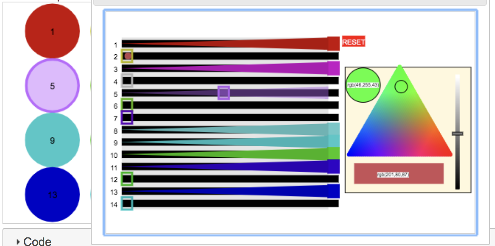

<!--
This file was generated by building the docs.
Please do not edit this file by hand.
Instead, edit the template and rebuild to docs.
-->

[](https://mybinder.org/v2/gh/AaronWatters/jp_doodle/master)
[](https://travis-ci.org/AaronWatters/jp_doodle)
[](https://coveralls.io/github/AaronWatters/jp_doodle?branch=master)

# `jp_doodle`

<b><code><a href="https://github.com/AaronWatters/jp_doodle">jp_doodle</a></em></code>
makes implementing special purpose interactive visualizations easy.</b>
It is designed to facilitate the development of bespoke scientific data presentation
and interactive exploration tools.

<p><b>Quick references:</b>
Please see the 
<a href="https://aaronwatters.github.io/jp_doodle/quick_references/Dual%20canvas%20Javascript%20quick%20reference.html">
Javascript quick reference</a>
or the 
<a href="https://aaronwatters.github.io/jp_doodle/quick_references/Dual%20canvas%20python%20quick%20reference.html">
Python/Jupyter quick reference</a>
for an introduction to building visualizations using `jp_doodle`.
</p>

Below is a screenshot of the 
<a href="https://aaronwatters.github.io/jp_doodle/095_nd_frames.html">multidimensional frames
example</a> using <code>jp_doodle</code> dual canvases.


Please click the <a href="https://youtu.be/nyuCqlTvf0c">youtube link</a> to view
a presentation about dual canvases and related technologies.

<a href="https://youtu.be/nyuCqlTvf0c">

</a>

The `jp_doodle` package provides `jQuery` plugins which make it easy to build
interactive visualizations in Javascript.  The package also provides Jupyter widget
interfaces to make it easy to build visualizations for Jupyter notebooks.

Most demonstration code is provided as Jupyter notebooks
under the
[`./notebooks`](./notebooks) directory.
You can 
<a href="https://nbviewer.jupyter.org/github/AaronWatters/jp_doodle/tree/master/notebooks">
view `./notebooks` using `nbviewer`</a>
or use
<a href="https://mybinder.org/v2/gh/AaronWatters/jp_doodle/master">
Binder</a>
to run the notebooks interactively.  The `Tutorial`
introduces dual canvases primarily from a Javascript
perspective.  The `Simple Python Examples` shows
some examples of using dual canvases in Jupyter widgets
using only the Python interface.  The `Feature demonstrations` sub-directory provides many other examples of how to use
the various features of dual canvases both in the Javascript and the Python contexts.


# Installation

To install the package for use with Jupyter notebooks:

```
python -m pip install https://github.com/AaronWatters/jp_doodle/zipball/master
```

Or if that doesn't work

```
python -m pip install https://github.com/AaronWatters/jp_doodle/zipball/master
```

To use the package with Jupyter Lab you also need to build the Jupyterlab Javascript
resources with widget support and `jp_proxy_widget`:

```
jupyter labextension install @jupyter-widgets/jupyterlab-manager  --no-build
jupyter labextension install jp_proxy_widget
```

# `dual_canvas`

The `dual_canvas` jQuery component of the `jp_doodle` package supports implementing
visualizations using two dimensional HTML5 canvas elements.  It provides

- Graphical object creation, deletion, mutation, and smooth feature transitions.

- Managed coordinate spaces including the pixel coordinate space, the canvas coordinate space
and reference frame coordinate spaces.

- Local and global event coordination to identify objects under positional mouse events and
relative event coordinate transformations.

- Bounding box calculation and canvas fitting support.

- Axis creation helpers.

- A built in "lasso tool" for selecting multiple objects in a canvas.

- Animation support.

- Python wrappers for building Jupyter widgets containing dual canvases .


<table>

<tr>
    <td>
        <a href="https://aaronwatters.github.io/jp_doodle/index.html">
        
        </a>
    </td>
    <td>
        <h4><a href="https://aaronwatters.github.io/jp_doodle/index.html">
        Drawing
        </a></h4>
        <div>
        <p>
The <code>jp_doodle</code> package includes <code>jQuery</code> plugins to
make figures that can interact with mouse events and may be animated.
</p>
<p>
In this figure we draw a number of objects on a canvas to illustrate
basic shapes.  The figure also responds to mouse-over events.
Move the mouse over the objects to see the "name" of the object undeneith
the mouse.
</p>
        </div>
    </td>
</tr>


<tr>
    <td>
        <a href="https://aaronwatters.github.io/jp_doodle/010_events.html">
        
        </a>
    </td>
    <td>
        <h4><a href="https://aaronwatters.github.io/jp_doodle/010_events.html">
        Events
        </a></h4>
        <div>
        <p>
This illustration uses mouse events associated to the whole
canvas to allow the user to drag elements using the mouse.
</p>
<p>
In this illustration you may move the named objects (everything colorful)
by mousing down on the object and dragging it to a new location and then mousing up.
</p>
        </div>
    </td>
</tr>


<tr>
    <td>
        <a href="https://aaronwatters.github.io/jp_doodle/020_bindings.html">
        
        </a>
    </td>
    <td>
        <h4><a href="https://aaronwatters.github.io/jp_doodle/020_bindings.html">
        Bindings
        </a></h4>
        <div>
        <p>
Canvases can respond to mouse events.  The mouse events can be associated to the
whole canvas or to named elements in the canvas.
</p>
<p>
In this illustration a different click event handler attaches
to each text area to change the text areas in different ways for 5 seconds.
</p>
        </div>
    </td>
</tr>


<tr>
    <td>
        <a href="https://aaronwatters.github.io/jp_doodle/030_animation.html">
        
        </a>
    </td>
    <td>
        <h4><a href="https://aaronwatters.github.io/jp_doodle/030_animation.html">
        Animation
        </a></h4>
        <div>
        Dual canvases can be animated.  This figure includes a clock with an animated
seconds hand and a blinking light.
        </div>
    </td>
</tr>


<tr>
    <td>
        <a href="https://aaronwatters.github.io/jp_doodle/040_lasso.html">
        
        </a>
    </td>
    <td>
        <h4><a href="https://aaronwatters.github.io/jp_doodle/040_lasso.html">
        Lasso
        </a></h4>
        <div>
        <p>
Dual canvasses provide a lasso feature which
allows the user to select a group of named elements
by encircling them with a polygonal "lasso".
</p>
<p>
In this figure the user may mouse down to draw a
polygon and mouse up to close the polygon.
Selected circles in the lassoed area will turn
from green to pink.
</p>
        </div>
    </td>
</tr>


<tr>
    <td>
        <a href="https://aaronwatters.github.io/jp_doodle/050_rectangles.html">
        
        </a>
    </td>
    <td>
        <h4><a href="https://aaronwatters.github.io/jp_doodle/050_rectangles.html">
        Rectangles
        </a></h4>
        <div>
        <p>
The <code>rectangle_collection.js</code> plugin provides
an experimental implementation of a two category bar chart.
This proof of concept is useful as an example of a complex
component built using <code>jp_doodle</code>.
</p>
<p>
Click "person type" or "State" to start and stop adjusting the
layout of the barchart.  Mouse over the rectangles and other labels
for detail information.
</p>
        </div>
    </td>
</tr>


<tr>
    <td>
        <a href="https://aaronwatters.github.io/jp_doodle/060_chart.html">
        
        </a>
    </td>
    <td>
        <h4><a href="https://aaronwatters.github.io/jp_doodle/060_chart.html">
        Chart
        </a></h4>
        <div>
        <p>
This chart proof of concept illustrates reference frames, object updates,
and responses to mouse interactions.  Mouse over the figure for detail
from the underlying data.
</p>
        </div>
    </td>
</tr>


<tr>
    <td>
        <a href="https://aaronwatters.github.io/jp_doodle/070_images.html">
        
        </a>
    </td>
    <td>
        <h4><a href="https://aaronwatters.github.io/jp_doodle/070_images.html">
        Images
        </a></h4>
        <div>
        You can draw images on canvases in two steps.
First you must load the image and identify it with a name,
and afterward you can draw the image any number of times
by providing x, y corner coordinates with width and height.
You may also specify a rectangle inside the image to draw.
        </div>
    </td>
</tr>


<tr>
    <td>
        <a href="https://aaronwatters.github.io/jp_doodle/080_transitions.html">
        
        </a>
    </td>
    <td>
        <h4><a href="https://aaronwatters.github.io/jp_doodle/080_transitions.html">
        Transitions
        </a></h4>
        <div>
        You can change named objects on canvases using smooth transitions 
which interpolate between one group of attribute values and another smoothly over a time period.
        </div>
    </td>
</tr>


<tr>
    <td>
        <a href="https://aaronwatters.github.io/jp_doodle/085_assemblies.html">
        
        </a>
    </td>
    <td>
        <h4><a href="https://aaronwatters.github.io/jp_doodle/085_assemblies.html">
        Assemblies
        </a></h4>
        <div>
        <p>
Assembly definitions may be specified using Javascript and attached
to a jp_doodle canvas.  The assemblies describe how to draw composite
objects which are manipulated as primative units in the jp_doodle
drawing system.
</p>
<p>
This demonstration attaches a "teddy bear" assembly definition and then
creates some teddy bear assemblies and other
standard assemblies on the
canvas.
</p>
<p>
You may move the assemblies
by mousing down on the object and dragging it to a new location and then mousing up.
</p>
        </div>
    </td>
</tr>


<tr>
    <td>
        <a href="https://aaronwatters.github.io/jp_doodle/090_frames.html">
        
        </a>
    </td>
    <td>
        <h4><a href="https://aaronwatters.github.io/jp_doodle/090_frames.html">
        Frames
        </a></h4>
        <div>
        <p>
Objects can be created in reference frames in 
order to share the same drawing order priority and the same coordinate system.
</p>
<p>
In this demonstration drag the
<span style="color:white; background-color:blue">blue controls</span>
to change the parameters of the frame on the right.
        </div>
    </td>
</tr>


<tr>
    <td>
        <a href="https://aaronwatters.github.io/jp_doodle/095_nd_frames.html">
        
        </a>
    </td>
    <td>
        <h4><a href="https://aaronwatters.github.io/jp_doodle/095_nd_frames.html">
        N-Dimensional Frames
        </a></h4>
        <div>
        <p>
Multidimensional frames allow data to be projected from higher
dimensions into 3 dimensions and then into 2 dimensions.  the
3 dimensional representation can be rotated or otherwise animated
before the presentation in 2 dimensions.
</p>
<p>
Below we draw elements with 3 dimensional coordinates.
Drag the mouse on the figure to rotate the diagram.
Shift-drag the mouse on the figure to translate the diagram.
</p>
        </div>
    </td>
</tr>


<tr>
    <td>
        <a href="https://aaronwatters.github.io/jp_doodle/110_nd_scatter.html">
        
        </a>
    </td>
    <td>
        <h4><a href="https://aaronwatters.github.io/jp_doodle/110_nd_scatter.html">
        N-Dimensional Scatter Plot
        </a></h4>
        <div>
        <p>
The multidimensional scatter plot widget allows interactive
exploration of dimensionality reduction projections that project
many features into three dimensional summaries.
</p>
<p>
The demonstration below shows the standard "iris" dataset
projected from 4 dimensions into 3 dimensions using several
projection methods.
</p>
        </div>
    </td>
</tr>


<tr>
    <td>
        <a href="https://aaronwatters.github.io/jp_doodle/120_network.html">
        
        </a>
    </td>
    <td>
        <h4><a href="https://aaronwatters.github.io/jp_doodle/120_network.html">
        Network Explorer
        </a></h4>
        <div>
        <p>
The directed network widget allows interactive
exploration of directed weighted network structures.
It was developed to facilitate the exploration and comparison of gene regulatory
networks which are inferred using different methodologies.
</p>
        </div>
    </td>
</tr>


<tr>
    <td>
        <a href="https://aaronwatters.github.io/jp_doodle/array_explorer.html">
        
        </a>
    </td>
    <td>
        <h4><a href="https://aaronwatters.github.io/jp_doodle/array_explorer.html">
        Array explorer
        </a></h4>
        <div>
        This component allows an analyst to compare the rows and columns of an array of data.
        </div>
    </td>
</tr>


<tr>
    <td>
        <a href="https://aaronwatters.github.io/jp_doodle/color_chooser.html">
        
        </a>
    </td>
    <td>
        <h4><a href="https://aaronwatters.github.io/jp_doodle/color_chooser.html">
        Color chooser
        </a></h4>
        <div>
        A color chooser.  Choose a color and then click an object to apply the color.
        </div>
    </td>
</tr>


<tr>
    <td>
        <a href="https://aaronwatters.github.io/jp_doodle/opacity.html">
        
        </a>
    </td>
    <td>
        <h4><a href="https://aaronwatters.github.io/jp_doodle/opacity.html">
        Opacity Sliders
        </a></h4>
        <div>
        This example uses a dual canvas in a JQueryUI dialog with multiple sliders to adjust
object colors and opacities in another dual canvas.
        </div>
    </td>
</tr>


<tr>
    <td>
        <a href="https://aaronwatters.github.io/jp_doodle/polygon.html">
        
        </a>
    </td>
    <td>
        <h4><a href="https://aaronwatters.github.io/jp_doodle/polygon.html">
        Edit polygon
        </a></h4>
        <div>
        A polygon editor which illustrates combining mouse event modalities with reference frames.
Click to start the polygon.  Type "." to drop a new vertex.
Click again to close the polygon.  Press the reset button to play again.
        </div>
    </td>
</tr>


<tr>
    <td>
        <a href="https://aaronwatters.github.io/jp_doodle/vector_field.html">
        
        </a>
    </td>
    <td>
        <h4><a href="https://aaronwatters.github.io/jp_doodle/vector_field.html">
        Vector Field
        </a></h4>
        <div>
        The vector field component adds an animation of directional moving points
on a canvas.
        </div>
    </td>
</tr>

</table>

