# `dual_canvas` Python quick reference.

This document is part of the 
<a href="https://github.com/AaronWatters/jp_doodle">`jp_doodle` (https://github.com/AaronWatters/jp_doodle)</a>
package.
It provides a quick reference
to using the `dual_canvas` object API in Python to build visualizations in
interactive Jupyter widgets.

The `dual_canvas` mechanism is designed to make it easy to develop special
purpose interactive scientific visualizations in Jupyter and other web contexts.
A `dual_canvas` widget built using the Python interface
can be used to build interactive and animated visualizations that live inside
a Jupyter IPython notebook document.  Discussions below illustrate how to create a canvas widget, draw things on the
canvas, modify and animate elements of a canvas, and associate mouse event actions to elements of a
canvas, among other topics.  

**About this document:** This document is an executable Jupyter notebook, or another document format
derived from the notebook.  The next "code cell" imports external functionality used in the notebook.
In the following discussion
we use the `eg.show(demo)` helper to optionally embed an image into
this notebook in order to facilitate file format conversion.  Please replace
this helper with `display(demo)` when you emulate these code fragments.


```python
from jp_doodle import dual_canvas
from IPython.display import display

import qr_helper as eg    # some helpers and tricks for embedding images
eg.DO_EMBEDDINGS = False  # flag indicates whether to embed images in the notebook or not (for format conversions)
```


<style>.container { width:100% !important; }</style>


## Part 1: Creating canvas widgets and frames in widgets and coordinates

To create and use the widgets you need to import the `dual_canvas` module in an IPython notebook
and you probably also will want to use `IPython.display.display`.

### Creating a `dual_canvas.DualCanvasWidget`

A dual canvas is a space on the IPython notebook to draw on using
drawing operations specified using (x,y) coordinates.
A newly created dual canvas initially has width and height given in device pixels.
The `dual_canvas.DualCanvasWidget`
constructor may optionally specify a default font.  The initial lower left corner is at (0,0)
and the upper right corner is at (width, height)


```python
def make_a_canvas():
    
    # Create a canvas with pixel coordinates (0...420, 0...120)
    demo = dual_canvas.DualCanvasWidget(width=420, height=120, font="italic 12px Courier",)
    
    # Put some reference marks on the canvas to illustrate the coordinate space.
    demo.text(x=0, y=0, text="0,0", color="red", background="yellow", )
    demo.text(x=410, y=110, text="410,110", align="right", color="red", background="yellow", )
    demo.lower_left_axes(min_x=10, min_y=10, max_x=410, 
                         max_y=110, x_anchor=150, y_anchor=40, max_tick_count=7, color="blue")
    eg.show(demo)  # replace with display(demo)

make_a_canvas()
```


    DualCanvasWidget(status='Not yet rendered')


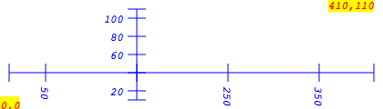


### Create a reference frame inside a dual canvas

Pixel coordinates are rarely the most convenient coordinate systems to
use for scientific visualizations.  Reference frames allow drawing using
transformed coordinates.  The `frame_region` method creates a frame
by mapping reference points in the pixel space to reference
points in the reference frame coordinate space.  Objects can then
be drawn on the reference frame and the underlying coordinates will be
converted automatically.


```python
def make_a_reference_frame():
    demo = dual_canvas.DualCanvasWidget(width=420, height=120)
    
    # Map pixel coords (10,10) and (400,100)
    #  to frame coords (-1, 0) and (1, 2)
    frame = demo.frame_region(
        minx=10, miny=10, maxx=400, maxy=100,
        frame_minx=-1, frame_miny=0, frame_maxx=1, frame_maxy=2,
    )
    # Put some reference marks on the frame to indicate the coordinates.
    frame.text(x=-1, y=0, text="-1,0", color="red", background="yellow", )
    frame.text(x=1, y=2, text="1,2", align="right", color="red", background="yellow", )
    frame.lower_left_axes(min_x=-1, min_y=0, max_x=1,
                         max_y=2, x_anchor=0, y_anchor=1, max_tick_count=7, color="blue")
    
    # also draw axes in canvas/pixel coordinates
    demo.lower_left_axes(min_x=10, min_y=10, max_x=410,
                         max_y=110, x_anchor=100, y_anchor=40, max_tick_count=7, color="pink")
    eg.show(demo)  # replace with display(demo)

make_a_reference_frame()
```


    DualCanvasWidget(status='Not yet rendered')


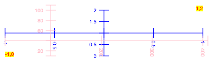


###  Create two reference frames inside a dual canvas

It is possible to create many reference frames inside a dual canvas each with a different
coordinate transform.


```python
def make_2_reference_frames():
    demo = dual_canvas.DualCanvasWidget(width=420, height=120)
    # draw pink axes in canvas/pixel coordinates behind the other figures.
    demo.lower_left_axes(min_x=10, min_y=10, max_x=410,
                         max_y=110, x_anchor=40, y_anchor=80, max_tick_count=7, color="pink")
    
    # Map pixel coords (10,10) and (190,100)
    #  to frame1 coords (-1, 0) and (1, 2)
    frame1 = demo.frame_region(
        minx=10, miny=10, maxx=190, maxy=100,
        frame_minx=-1, frame_miny=0, frame_maxx=1, frame_maxy=2,
    )
    # Put some reference marks on the frame1 to indicate the coordinates.
    frame1.text(x=-1, y=1.8, text="frame1", color="blue", background="white", )
    frame1.text(x=-1, y=0, text="-1,0", color="red", background="yellow", )
    frame1.text(x=1, y=2, text="1,2", align="right", color="red", background="yellow", )
    frame1.lower_left_axes(min_x=-1, min_y=0, max_x=1,
                         max_y=2, x_anchor=0, y_anchor=1, max_tick_count=7, color="blue")
                         
    # Map pixel coords (210,10) and (400,100)
    #  to frame coords (-1, 0) and (1, 2)
    frame2 = demo.frame_region(
        minx=210, miny=10, maxx=400, maxy=100,
        frame_minx=-1, frame_miny=0, frame_maxx=1, frame_maxy=2,
    )
    # Put some reference marks on the frame2 to indicate the coordinates.
    frame2.text(x=-1, y=1.8, text="frame2", color="green", background="white", )
    frame2.text(x=-1, y=0, text="-1,0", color="white", background="magenta", )
    frame2.text(x=1, y=2, text="1,2", align="right", color="white", background="magenta", )
    frame2.lower_left_axes(min_x=-1, min_y=0, max_x=1,
                         max_y=2, x_anchor=0, y_anchor=1, max_tick_count=7, color="green")
                         
    eg.show(demo)  # replace with display(demo)

make_2_reference_frames()
```


    DualCanvasWidget(status='Not yet rendered')


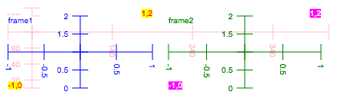


###  Get a simplified frame using `swatch`

The `swatch` convenience helper is useful to create square canvases with a single frame
where the X and Y coordinates have the same scale.


```python
def make_a_swatch():
    
    # Create a frame with pixel coordinates 200 by 200 using swatch:
    frame = dual_canvas.swatch(
        pixels=200,       # width and height of 200 pixels
        model_height=4.5, # width and height in frame coordinates
        cx=4,
        cy=-3,            # center of canvas at (4, -3) in frame coordinates (default (0, 0))
        snapfile=None,    # if this is set to a file path the widget will be a snapshot widget (default None)
        show=False,       # automatically display the widget if true (default True)
    )
    # Put some reference marks on the canvas to indicate the coordinates.
    frame.text(x=2, y=-5, text="2,-5", color="red", background="yellow", )
    frame.text(x=6, y=-1, text="6,-1", align="right", color="red", background="yellow", )
    frame.lower_left_axes(min_x=2, min_y=-5, max_x=6, 
                         max_y=-1, x_anchor=4, y_anchor=-3, max_tick_count=7, color="blue")
    eg.show(frame)  # replace with display(frame)

make_a_swatch()
```


    DualCanvasWidget(status='Not yet rendered')


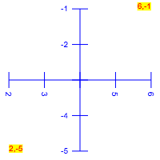


The return value for `swatch` is a reference frame.  The underlying canvas widget associated
with the frame is available as `frame.get_canvas()`.

###  Simplified coordinates using the `fit()` method

It is often convenient to draw objects on a canvas or frame and then use the `fit` method to automatically
adjust the coordinate conversions so the visible objects are visible in the frame.  Fit will compute the
maximum and minimum coordinate values drawn and automatically adjust the canvas coordinate conversion
so that the objects are in view and "fill" the canvas in either the X or Y dimension (or both).

**Warning:** Buggy code that uses `fit()` may make objects that are so far apart
that they are too small to be seen after the `fit()` operation.

*Note:* Below we do not explicitly choose the center of the frame or the
endpoints of the axes because they are derived from the coordinate system
chosen by `fit` automatically.


```python
def fit_a_swatch():
    
    # Create a canvas with pixel coordinates 200 by 200 using swatch:
    #   Note: we don't specify the center because fit() below will chose the appropriate center.
    frame = dual_canvas.swatch(200, 4.5, show=False)
    # Put some reference marks on the canvas to indicate the coordinates.
    frame.text(x=2, y=-5, text="2,-5", color="red", background="yellow", )
    frame.text(x=6, y=-1, text="6,-1", align="right", color="red", background="yellow", )
    # fit the text objects into the canvas
    frame.fit()
    
    # Draw axes using the coordinate system chosen by the fit operation above
    #   Note: the max and min coordinates are not specified because they are inferred from the fit.
    frame.lower_left_axes(max_tick_count=5, x_anchor=4, y_anchor=-3, color="blue")
    
    # Fit the objects drawn into the canvas again allowing a margin of 20 pixels
    frame.fit(margin=20)
    eg.show(frame)  # replace with display(frame)

fit_a_swatch()
```


    DualCanvasWidget(status='Not yet rendered')


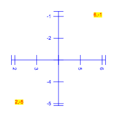


### 1.6 Create a "Snapshot canvas"

```Python
widget = dual_canvas.SnapshotCanvas(filename="snapshot_image_file.png", width=420, height=120)
widget.display_all()  # Show the canvas inside the snapshot tab.
```

# Part 2: Drawing on canvases and frames


Dual canvases and reference frames on dual canvases support a number of drawing operations
described below.

The discussion makes use of the helper module to present the draw operations
and their visual results shown with a reference axis without having to repeat boilerplate
code (like creating a canvas and an axis over and over and over....).

Objects may be drawn directly using the canvas (in which case the canvas is also
the reference frame) or with respect to a reference frame derived from the canvas.

Note that some objects (`text`, `circle`, and, `rect`) are sized relative to the
canvas, not relative to any reference frame, in order to allow consistent mark sizes
across all frames of a canvas.  The `frame_rect` and `frame_circle` variants
are sized relative to the current frame.  All objects are positioned relative
to the current frame,


```python
eg.py_line_example()
```


### Drawing lines

The `line` method draws a line segment between two end points.


```Python

    widget.line(
        x1=50, y1=10,   # One end point of the line
        x2=320, y2=30,  # The other end point of the line
        color="cyan",   # Optional color (default: "black")
        lineWidth=4,    # Optional line width
        lineDash=[5,2,1], # Optional line dash pattern
    )

```


    DualCanvasWidget(status='Not yet rendered')


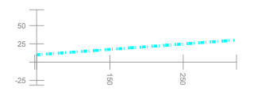


```python
eg.py_arrow_example()
```


### Drawing arrows

The `arrow` method draws an arrow between a head position and a tail position.


```Python

    widget.arrow(
        head_length=30,
        x1=50, y1=10,   # The tail end point of the line
        x2=320, y2=70,  # The head end point of the line
        color="red",   # Optional color (default: "black")
        lineWidth=4,    # Optional line width
        lineDash=[2,2], # Optional line dash pattern
        head_angle=45,  # Optional head segment angle in degrees (default 45)
        head_offset=10,  # Optional offset of head from endpoint
        symmetric=True, # If true draw two arrow head segments (default False)
    )

```


    DualCanvasWidget(status='Not yet rendered')


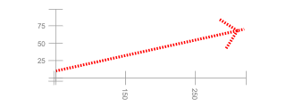


```python
eg.py_double_arrow_example()
```


### Drawing double arrows

The `double_arrow` method draws an arrow between a head position and a tail position
with head marks at both ends.


```Python

    widget.double_arrow(
        head_length=30,
        x1=50, y1=10,   # The tail end point of the line
        x2=320, y2=70,  # The head end point of the line
        color="red",   # Optional color (default: "black")
        back_color="blue",  # Optional color of back arrow
        lineWidth=4,    # Optional line width
        lineDash=[2,2], # Optional line dash pattern
        head_angle=45,  # Optional head segment angle in degrees (default 45)
        back_angle=90,   # Optional back head segment angle
        head_offset=10,  # Optional offset of head from endpoint
        back_offset=0,   # Optional, offset of back pointing head mark
        symmetric=False, # If true draw two arrow head segments (default False)
        line_offset=5,  # offset of back arrow from forward arros
    )

```


    DualCanvasWidget(status='Not yet rendered')


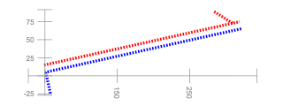


```python
eg.py_polyline_example()
```


### Drawing polylines

The `polyline` method draws sequence of connected line segments.


```Python

    points = [(50,20), (40, 60), (140, 111), (300,4), (100,70)]
    widget.polyline(
        points=points, # The vertices of the polyline path
        color="green",   # Optional color (default: "black")
        lineWidth=3,    # Optional line width
        lineDash=[5,5], # Optional line dash pattern
    )

```


    DualCanvasWidget(status='Not yet rendered')


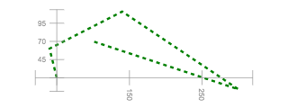


```python
eg.py_polygon_example()
```


### Drawing polygons

The `polygon` method draws closed sequence of connected line segments.


```Python

    points = [(50,20), (40, 60), (140, 111), (300,4), (100,70)]
    widget.polygon(
        points=points, # The vertices of the polyline path
        color="green",   # Optional color (default: "black")
        lineWidth=3,    # Optional line width
        lineDash=[5,5], # Optional line dash pattern
        fill=False,     # Optional, if True (default) fill interior
    )

```


    DualCanvasWidget(status='Not yet rendered')


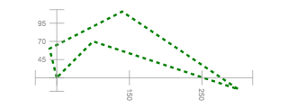


```python
eg.py_circle_example()
```


### Drawing circles with canvas relative radius

The `circle` method draws a circle sized relative to the canvas
coordinate system.  Circles on two frames with the same radius
will have the same size.


```Python
   
    frame = widget.frame_region(
        minx=10, miny=10, maxx=100, maxy=100,
        frame_minx=-3, frame_miny=0, frame_maxx=3, frame_maxy=6,
    )
    # Draw a circle positioned relative to the frame and sized relative to the canvas.
    frame.circle(
        x=4,
        y=2.5,
        r=20,  # radius "r" is in canvas coordinates, not frame coordinates
        color="blue",
        fill=False,
        lineWidth=5,
        lineDash=[5,5],
    )

```


    DualCanvasWidget(status='Not yet rendered')


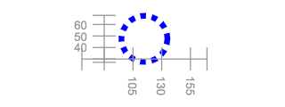


```python
eg.py_frame_circle_example()
```


### Drawing circles with frame relative radius

The `frame_circle` method draws a circle sized relative to the current reference frame
coordinate system.  Frame circles on two frames with the same radius
may have different sizes if the scaling differs between the frames.


```Python
   
    frame = widget.frame_region(
        minx=10, miny=10, maxx=100, maxy=100,
        frame_minx=-3, frame_miny=0, frame_maxx=3, frame_maxy=6,
    )
    # Draw a circle positioned and sized relative to the frame.
    frame.frame_circle(
        x=4,
        y=2.5,
        r=3,  # radius "r" is in frame coordinates
        color="blue",
        fill=True,
    )

```


    DualCanvasWidget(status='Not yet rendered')


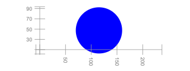


```python
eg.py_star_example()
```


### Drawing stars

The `star` method draws a star on the canvas.


```Python
   
    # Draw a star (always positioned and sized relative to the frame)
    widget.star(
        x=40, y=25, radius=30,
        points=5,   # optional number of points
        point_factor=2.1,  # optional scale factor for outer radius
        color="magenta",
        fill=False,
        lineWidth=5,
        lineDash=[5,5],
    )

```


    DualCanvasWidget(status='Not yet rendered')


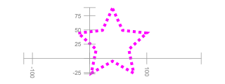


```python
eg.py_rect_example()
```


### Drawing rectangles with canvas relative size

The `rect` method draws a rectangle sized relative to the canvas
coordinate system.  `rect`s on two frames with the same width and height
will have the same size.


```Python
 
    frame = widget.frame_region(
        minx=10, miny=10, maxx=100, maxy=100,
        frame_minx=-3, frame_miny=0, frame_maxx=3, frame_maxy=6,
    )

    # Draw a rectangle positioned and sized relative to the frame.
    (x,y) = (4, 2.5)
    frame.rect(
        x=x, y=y,  # rectangle position relative to the frame
        w=50, h=40,  # width and height relative to the canvas
        dx=-10, dy=-10,  # offset of lower left corner from (x,y) relative to the canvas
        color="green",
        degrees=10,  # optional rotation in degrees
        fill=False,
        lineWidth=5,
        lineDash=[5,5],
    )
    # Draw a reference point at (x, y)
    frame.circle(x, y, 5, "red")
    frame.lower_left_axes(color="pink")

```


    DualCanvasWidget(status='Not yet rendered')


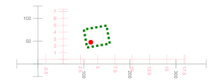


```python
eg.py_canvas_rect_example()
```


### Drawing rectangles with frame relative size

The `frame_rect` method draws a rectangle sized relative to the current reference frame
coordinate system.  `frame_rect`s on two frames with the same width and height
may have the different sizes.


```Python
    
    frame = widget.frame_region(
        minx=10, miny=10, maxx=100, maxy=100,
        frame_minx=-3, frame_miny=0, frame_maxx=3, frame_maxy=6,
    )
    # Draw a rectangle positioned and sized relative to the frame.
    (x,y) = (4, 2.5)
    frame.frame_rect(
        x=x, y=y,  # rectangle position
        w=5, h=4,  # width and height relative to frame
        dx=-1, dy=-1,  # offset of lower left corner from (x,y) relative to frame
        color="green",
        fill=False,
        degrees=10,  # optional rotation in degrees
        lineWidth=5,
        lineDash=[5,5],
    )
    # Draw a reference point at (x, y)
    frame.circle(x, y, 5, "red")
    frame.lower_left_axes(color="pink")

```


    DualCanvasWidget(status='Not yet rendered')


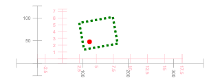


```python
eg.py_text_example()
```


### Drawing text

The `text` method draws a text screen on the canvas.
The position of the text is determined by the current reference frame
but the text font parameters are relative to the shared canvas coordinate space.


```Python
   
    (x, y) = (50,20)
    widget.text(
        x=x, y=y, 
        text="We the people",
        color="white",   # Optional color (default: "black")
        font="italic 52px Courier",   # optional
        background="#a00",  # optional
        degrees=-15,  # optional rotation in degrees
        align="center", # or "left" or "right", optional
        valign="center",  # or "bottom", optional
    )
    # Draw a reference point at (x, y)
    widget.circle(x, y, 5, "magenta")

```


    DualCanvasWidget(status='Not yet rendered')


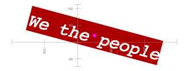


```python
eg.py_full_image_example()
```


### Drawing whole images

Before an image can be drawn on a canvas
the image must be loaded.  The `name_imagea_url` methodß
loads an image from a file or a remote resource.
After the image has been loaded and named the `named_image`
draws the loaded image.  If no subimage is specified
the whole image is drawn into the rectangular region.
A loaded image may be drawn any number of times.


```Python
   
    # load the image from a remote resource
    mandrill_url = "http://sipi.usc.edu/database/preview/misc/4.2.03.png"
    widget.name_image_url(
        image_name="mandrill",
        url=mandrill_url,
    )
    # draw the named image (any number of times)
    (x, y) = (50,20)
    widget.named_image(  # Draw the *whole* image (don't specify the s* parameters)
        image_name="mandrill",
        x=x, y=y,  # rectangle position relative to the canvas
        w=150, h=140,  # width and height relative to the frame
        dx=-30, dy=-50,  # optional offset of lower left corner from (x,y) relative to the canvas
        degrees=10,  # optional rotation in degrees
    )
    # Draw a reference point at (x, y)
    widget.circle(x, y, 5, "magenta")

```


    DualCanvasWidget(status='Not yet rendered')


**Note:** The canvas created above is marked "tainted" 
because it loads an image from a remote origin and security restrictions in the browser
prevent the canvas from being converted to an image.  Here is a screen capture of the
live canvas when executed:

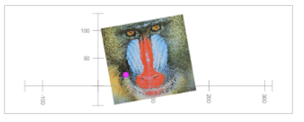


```python
eg.py_part_image_example()
```


### Drawing parts of images

The `named_image`
draws part of a loaded image if the subimage parameters
sx, sy, sWidth, and sHeight are specified.


```Python
 
    # load the image from a remote resource
    mandrill_url = "http://sipi.usc.edu/database/preview/misc/4.2.03.png"
    widget.name_image_url(
        image_name="mandrill",
        url=mandrill_url,
    )
    # draw the named image (any number of times)
    (x, y) = (50,20)
    widget.named_image(  # Draw just the eyes (by specifying the subimage)
        image_name="mandrill",
        x=x, y=y,  # rectangle position relative to the canvas
        w=150, h=40,  # width and height relative to the frame
        dx=-30, dy=-10,  # optional offset of lower left corner from (x,y) relative to the canvas
        degrees=10,  # optional rotation in degrees
        sx=30, sy=15, # subimage upper left corner in image coordinates
        sWidth=140, sHeight=20,  # subimage extent in image coordinates
    )
    # Draw a reference point at (x, y)
    widget.circle(x, y, 5, "magenta")

```


    DualCanvasWidget(status='Not yet rendered')


**Note:** The canvas created above is marked "tainted" 
because it loads an image from a remote origin and security restrictions in the browser
prevent the canvas from being converted to an image.  Here is a screen capture of the
live canvas when executed:

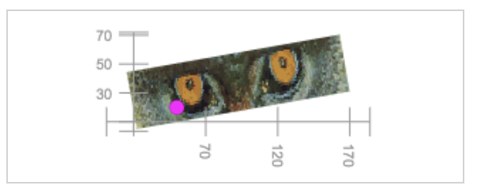


```python
eg.py_bw_image_example()
```


### Drawing black and white images from arrays

The `name_image_array`
can load a black and white image from a
2 dimensional `numpy` array.  The numeric values in the
array should be in the range from 0 to 255.


```Python
 
    # Make a "black and white" array.
    import numpy as np
    checkerboard = np.zeros((8,8))
    for i in range(8):
        for j in range(8):
            if (i + j) % 2 == 0:
                checkerboard[i,j] = 64 + 3*i*j
    # Load the image from the array.
    widget.name_image_array( 
        image_name="checkerboard",
        np_array=checkerboard,
    )
    # draw the named image (any number of times)
    (x, y) = (50,20)
    widget.named_image(  # Draw just the eyes (by specifying the subimage)
        image_name="checkerboard",
        x=x, y=y,  # rectangle position relative to the canvas
        w=150, h=140,  # width and height relative to the frame
        dx=-30, dy=-10,  # offset of lower left corner from (x,y) relative to the canvas
        degrees=10,  # optional rotation in degrees
    )
    # Draw a reference point at (x, y)
    widget.circle(x, y, 5, "magenta")

```


    DualCanvasWidget(status='Not yet rendered')


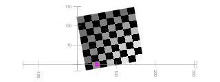


```python
eg.py_color_image_example()
```


### Drawing color images from arrays

The `name_image_array`
can load a color image from a
3 dimensional `numpy` array of shape "width by height by 3"
or "width by height by 4".  The values at `array[:,:,1:3]` represent
the red, green, and blue color values for the pixel and should be in the range 0 to 255.
If provided the values at `array[:,:,3]` represent the opacity of the
pixel and should be in the range 0 (transparent) to 1.0 (fully opaque).


```Python
 
    # Make a "color" numpy array
    import numpy as np
    checkerboard = np.zeros((8,8,3))
    R = G = B = 255
    for i in range(8):
        for j in range(8):
            if (i + j) % 2 == 0:
                checkerboard[i,j] = (R, G, B)
                R = (G + 123) % 256
            else:
                checkerboard[i,j] = (G, R, R)
                G = (R + 201) % 256
    # Load the image from the array     
    widget.name_image_array(
        image_name="checkerboard",
        np_array=checkerboard,
    )
    # draw the named image (any number of times)
    (x, y) = (50,20)
    widget.named_image(  # Draw just the eyes (by specifying the subimage)
        image_name="checkerboard",
        x=x, y=y,  # rectangle position relative to the canvas
        w=150, h=140,  # width and height relative to the frame
        dx=-30, dy=-10,  # offset of lower left corner from (x,y) relative to the canvas
        degrees=-50,  # optional rotation in degrees
    )
    # Draw a reference point at (x, y)
    widget.circle(x, y, 10, "yellow")

```


    DualCanvasWidget(status='Not yet rendered')


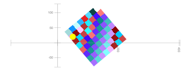


### Drawing axes

The `left_axis`, `right_axis`, `bottom_axis`, `top_axis`, and `lower_left_axis` methods
draw axes on the canvas.


```python
def axes_demos():
    widget = dual_canvas.DualCanvasWidget(width=420, height=120, font="italic 12px Courier",)

    widget.left_axis(
        min_value=10,
        max_value=80,
        axis_origin=dict(x=40, y=0),
        max_tick_count=3,
        color="green",
        add_end_points=True
    )
    widget.right_axis(
        min_value=10,
        max_value=80,
        axis_origin=dict(x=240, y=0),
        max_tick_count=7,
        color="red"
    )
    widget.bottom_axis(
        min_value=60,
        max_value=110,
        axis_origin=dict(x=0, y=20),
        max_tick_count=5,
        color="blue"
    )
    widget.top_axis(
        min_value=130,
        max_value=180,
        axis_origin=dict(x=0, y=100),
        max_tick_count=5,
        color="orange"
    )

    widget.lower_left_axes(
        min_x=50, 
        min_y=30, 
        max_x=210, 
        max_y=90, 
        x_anchor=130, 
        y_anchor=66, 
        max_tick_count=4, 
        color="brown")

    widget.fit(margin=10)
    eg.show(widget)  # replace with display(demo)

axes_demos()
```


    DualCanvasWidget(status='Not yet rendered')


# Part 3: Events and mutations

Objects which have been explicitly named can be changed (moved, resized, deleted, transitioned, etcetera)
and unless events are disabled for the object the object can respond to mouse events (mouse over,
click, etcetera).

### Attaching event callbacks

The `object.on(etype, callback)`
attaches a `callback` to be called when the object
recieves an event of type `etype`.


```python
def py_event_example():
    widget = dual_canvas.DualCanvasWidget(width=120, height=120)

    # this circle cannot be mutated and does not respond to events because it is not named.
    widget.circle(x=0, y=0, r=100, color="#e99")

    # this text is named and can be mutated and can respond to events
    txt1 = widget.text(x=0, y=0, text="Click me please", degrees=45, name=True,
               font= "40pt Arial", color="#e3e", background="#9e9", align="center", valign="center")

    # add a click event bound to the txt which transitions the text rotation
    def on_click(*ignored):
        txt1.transition(text="That tickles", degrees=720, color="#f90", background="#009", seconds_duration=5)

    txt1.on("click", on_click)

    widget.fit()
    eg.show(widget)  # replace with display(demo)

py_event_example()
```


    DualCanvasWidget(status='Not yet rendered')


### Unnamed objects are invisible to events

If an object is not named it will not respond to events
but a named object drawn undernieth the unnamed object may
receive the event.
A named object may also disable events by setting `events=False`
-- the resulting object can be changed or deleted but it will not respond to events:
```Python
widget.circle(x=0, y=0, r=100, color="#e99", name=True, events=False)
```
Below the circle obscures the text but clicks in the
center of the circle are recieved by the text.


```python
def py_no_name_no_event():
    widget = dual_canvas.DualCanvasWidget(width=120, height=120)

    # this text is named and can be mutated and can respond to events
    txt2 = widget.text(x=0, y=0, text="CLICK THE CENTER", degrees=45, name=True,
               font= "40pt Arial", color="#E3E", background="#9e9", align="center", valign="center")

    # this circle cannot be mutated and does not respond to events because it is not named.
    # Clicks on the circle above the underlying text will propagate to the text object.
    widget.circle(x=0, y=0, r=100, color="#e99")

    # add a click event bound to the txt which transitions the text rotation
    def on_click(*ignored):
        txt2.transition(text="That tickles", degrees=720, color="#f90", background="#009", seconds_duration=5)

    txt2.on("click", on_click)

    widget.fit()
    eg.show(widget)  # replace with display(demo)
    
py_no_name_no_event()
```


    DualCanvasWidget(status='Not yet rendered')


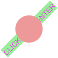


### Only the top named object responds to events

Only the top named object under an event receives the event even if
it is drawn using a transparent color.
Any object underneith the top object will not receive the event.


```python
def py_top_object_event():
    widget = dual_canvas.DualCanvasWidget(width=120, height=120)

    # this text is named and can be mutated and can respond to events
    txt3 = widget.text(x=0, y=0, text="TRY CLICKING CENTER", degrees=45, name=True,
               font= "40pt Arial", color="#E3E", background="#9e9", align="center", valign="center")

    # this circle CAN be mutated and DOES respond to events because it is named.
    # and clicks on the circle will NOT "propagate" to the text object underneith.
    circ3 = widget.circle(x=0, y=0, r=100, color="#e99",
                 name=True)

    # add a click event bound to the txt which transitions the text rotation
    def on_click(*ignored):
        txt3.transition(text="That tickles", degrees=720, color="#f90", background="#009", seconds_duration=5)
        circ3.change(color="red")

    txt3.on("click", on_click)

    widget.fit()
    eg.show(widget)  # replace with display(demo)
    
py_top_object_event()
```


    DualCanvasWidget(status='Not yet rendered')


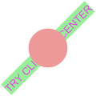


### Changing, transitioning, forgetting, and hiding named objects

Named objects have methods which allow them to be modified or related to interactive events.

```Python
# Change the object options.
object.change(**changed_options)

# Transition the object options over a time period.
object.transition(seconds_duration, **changed_options)

# Make the object invisible and unresponsive to events
object.visible(False)

# Make the object visible and enable event bindings.
object.visible(True)

# Remove the object from the canvas and dispose of it.
object.forget()
```

### Binding and unbinding event callbacks to named objects

```Python
# Attach an event handler to call when event_type effects the object.
object.on(event_type, handler)

# Detach any event handler associated with event_type for the object.
object.off(event_type)
```

Event types include `click`, `mousedown`, `mouseup`, `mouseout`, `mouseover`, `mousemove`, `keydown`
among others.  Please see 
<a href="https://developer.mozilla.org/en-US/docs/Web/Events">https://developer.mozilla.org/en-US/docs/Web/Events</a>
and <a href="https://api.jquery.com/on/">https://api.jquery.com/on/</a>
for more information about events.

### Addressing objects by name

Objects can be identified by name and modified using methods attached to the canvas widget.

```Python
# Change object properties by object name.
canvas.change(name, **changed_options)

# Destroy objects with a sequence of names.
canvas.forget_objects(names)

# Show or hide objects identified by a name sequence.
canvas.set_visibilities(names, visibility)

# Add an event binding to an object by name or the whole canvas if for_name is None.
canvas.on_canvas_event(event_type, callback, for_name=None, abbreviated=True, delay=True)

# Remove an event binding from an object by name or from the whole canvas if for_name is None.
canvas.off_canvas_event(event_type, for_name=None)
```

### The event callback

Event callbacks receive a dictionary argument `event` describing the event.
Descriptive slots include:

- `event["type"]` gives the type of the event (like `click`).
- `event["canvas_name"]` give the name of the object under the event, if any (some events are associated to the canvas and have no target object on the canvas).
- `event["model_location"]` gives the coordinate position on the canvas or reference frame associated with
the event as a dictionary like `{'x': -0.21, 'y': 0.28}`.
- `event["reference_frame"]["name"]` gives the name of the reference frame for the canvas if the event
is associated with a reference frame.


```python
event = None

def event_callback_example():
    widget = dual_canvas.DualCanvasWidget(width=220, height=220)

    frame = widget.frame_region(
        minx=10, miny=10, maxx=200, maxy=200,
        frame_minx=-1, frame_miny=-1, frame_maxx=1, frame_maxy=1,
        name="EVENT_REFERENCE_FRAME"
    )
    frame.lower_left_axes(min_x=-1, min_y=-1, max_x=1, max_y=1, color="pink", max_tick_count=4)
    txte = frame.text(-0.5, 0.25, "CLICK ME", name="EVENT_EXAMPLE_TEXT", background="#eea")

    def callback(e):
        global event
        event = e
        txte.change(text="Thanks!", background="#aee")

    txte.on("click", callback)
    
    eg.show(widget)  # replace with display(demo)
    
event_callback_example()
```


    DualCanvasWidget(status='Not yet rendered')


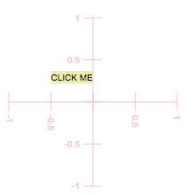


```python
if event is None:
    print("The object has not been clicked")
else:
    print("The event was of type", event["type"])
    print("Clicked object named", event["canvas_name"])
    print("Click was positioned in the reference frame coordinates at", event["model_location"])
    print("The reference frame for the click was named", event["reference_frame"]["name"])
#event
```

    The object has not been clicked


When the previous cell runs after the `txte` object is clicked the cell prints eomething similar to the following:
```
The event was of type click
Clicked object named EVENT_EXAMPLE_TEXT
Click was positioned in the reference frame coordinates at {'x': -0.2302634791324013, 'y': 0.2726244474712171}
The reference frame for the click was named EVENT_REFERENCE_FRAME
```

### Selecting named objects by surrounding them with a lasso

The `widget.do_lasso(callback)` method allows the user to select named objects
by surrounding them with a graphical loop.  After the loop is complete the callback
receives a dictionary mapping the names of the selected objects to their descriptions.


```python
mapping = None

widget = dual_canvas.DualCanvasWidget(width=420, height=150)

def py_lasso_demo():
    info = widget.text(10, 10, "Mouse down and draw lasso to encircle elements.", name="info")
    left = widget.text(50, 50, "Left", name="left", background="#ffe", color="red")
    center = widget.text(100, 50, "Center", name="center", background="#ffe", color="blue")
    above = widget.text(100, 75, "Above", name="above", background="#ffe", color="green")
    below = widget.text(100, 25, "Below", name="below", background="#ffe", color="brown")
    right = widget.text(150, 50, "Right", name="right", background="#ffe")

    def callback(m):
        global mapping
        mapping = m
        info.change(text="selected: " + str(list(mapping.keys())) + ". Play again!")
        # set up the lasso again
        widget.do_lasso(callback)

    widget.fit()

    widget.do_lasso(callback)
    
    eg.show(widget)  # replace with display(demo)

py_lasso_demo()
```


    DualCanvasWidget(status='Not yet rendered')


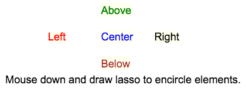


```python
if mapping is None:
    print ("Lasso was not completed.")
else:
    print ("Lassoed", len(mapping), "objects.")
    for name in mapping:
        info = mapping[name]
        print("   name:", name, "at", info["x"], info["y"], "shape", info["shape_name"], "color", info["color"])
```

    Lasso was not completed.


After encircling "Above" and "Center" the cell above prints

```
Lassoed 2 objects.
   name: above at 100 75 shape text color green
   name: center at 100 50 shape text color blue
```

#### Adding a floating tooltip for named elements

The `widget.enable_tooltip(tooltip_attribute="tip", background="cyan")`
causes named objects to pop up a tooltip showing the value of the
`tip` attribute when the mouse is over the object.


```python
def py_tooltip_demo():
    widget = dual_canvas.DualCanvasWidget(width=420, height=150)

    info = widget.text(10, 10, "Mouse over named elements to see tooltip.", tip="this unnamed element will not respond!")
    left = widget.text(50, 50, "Left", name="left", background="#ff7", tip="the left most <br> named element")
    center = widget.text(100, 50, "Center", name="center", background="#ff7", tip="the central <br> named element")
    above = widget.text(100, 75, "Above", name="above", background="#ff7", tip="the upper most <br> named element")
    below = widget.text(100, 25, "Below", name="below", background="#ff7", tip="the lower most <br> named element")
    right = widget.text(150, 50, "Right", name="right", background="#ff7", tip="the right most <br> named element")

    widget.fit()

    widget.enable_tooltip(tooltip_attribute="tip", background="cyan", font="bold 10px Arial")
    widget.element.jp_doodle_tooltip.css({"border-radius": "5px", "padding": "4px"})

    eg.show(widget)  # replace with display(demo)
    
py_tooltip_demo()
```


    DualCanvasWidget(status='Not yet rendered')


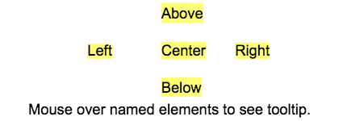


## Part 4: Other canvas and frame methods


### Preventing redraws during complex updates.

```Python
# Do not redraw the widget until both update operations are complete.
with widget.delay_redraw():
    complex_update1(widget)
    complex_update2(widget)
```

### Remove all objects and reset internal data structures

The following will remove and destroy all objects from a canvas and reset
the canvas to its initial configuration.

```Python
widget.reset_canvas()
```

The following will remove and destroy all objects from a canvas and reset
a frame to its initial configuration.

```Python
frame.reset_frame()
```

### Pop out dialog

The `in_dialog` method places the canvas in a floating JQueryUI dialog.

```Python
widget.in_dialog()
```

### Execute callback at next animation frame

The `requestAnimationFrame` method calls the
callback when the screen refreshes.

```Python
widget.requestAnimationFrame(callback)
```

### Recalibrate a frame

The following will reposition and rescale a frame

```Python
frame.set_region(
    minx, miny, maxx, maxy, 
    frame_minx, frame_miny, frame_maxx, frame_maxy)
```

### Show debug output area

The `widget.debugging_display()` method generates a composite widget
which provides verbose debugging information that may provide information
about exceptions or other problems which occur during the development
of a canvas viaualization.

```Python
widget.debugging_display()
```


```python

```
