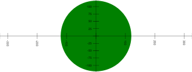

# Tests of embedding methods

This notebook exercises code used to embed canvas presentations
as images into notebooks.  These features are mainly used in documentation.


```python
# Save a canvas to an image file and embed the image file back into the notebook.

from jp_doodle import dual_canvas, auto_capture
from IPython.display import display
```


```python
embed_widget = dual_canvas.DualCanvasWidget(width=320, height=220)

with auto_capture.SaveAndEmbed(embed_widget, "embedded_image.png"):
    embed_widget.circle(x=0, y=0, r=100, color="#e99")
    txt = embed_widget.text(x=0, y=0, text="Hello World", degrees=45, name=True,
               font= "40pt Arial", color="#ee3", background="#9e9", align="center", valign="center")
    embed_widget.fit()
    display(embed_widget)
```


    DualCanvasWidget(status='Not yet rendered')


<div>Image from widget:</div>


```python
J = auto_capture.JavascriptExample(
    "A circle",
    '''
    element.circle({name: "full filled", x:0, y:0, r:120, color:"green"});
    element.fit();
    element.lower_left_axes();
    ''',
    "example_circle.png"
)
```


```python
J()
```


A circle


```Javascript

    element.circle({name: "full filled", x:0, y:0, r:120, color:"green"});
    element.fit();
    element.lower_left_axes();
    
```


    DualCanvasWidget(status='Not yet rendered')


<div>Image from widget:</div>




```python
globals
```


    <function globals()>


```python
P = auto_capture.PythonExample(
    "A circle in python",
    '''
    widget.circle(name="full filled", x=0, y=0, r=120, color="pink");
    widget.fit();
    widget.lower_left_axes();
    ''',
    "example_circle2.png"
)
```


```python
P()
```


A circle in python


```Python

    widget.circle(name="full filled", x=0, y=0, r=120, color="pink");
    widget.fit();
    widget.lower_left_axes();
    
```


    DualCanvasWidget(status='Not yet rendered')


<div>Image from widget:</div>


```python

```
