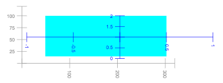

# `dual_canvas` Javascript quick reference.


This document is part of the 
<a href="https://github.com/AaronWatters/jp_doodle">`jp_doodle` (https://github.com/AaronWatters/jp_doodle)</a>
package.
It provides a quick reference
to using the `dual_canvas` Javascript API to build visualizations in
web contexts (including Jupyter notebooks).

The `dual_canvas` mechanism is designed to make it easy to develop special
purpose interactive scientific visualizations in web contexts.
A `dual_canvas` widget built using the Javascript interface
can be used to build interactive and animated visualizations that live inside
any HTML 5 web page.  Discussions below illustrate how to create a canvas, draw things on the
canvas, modify and animate elements of a canvas, and associate mouse event actions to elements of a
canvas, among other topics.  

**About this document:** This document is an executable Jupyter notebook, or another document format
derived from the notebook.  The next "code cell" imports external functionality used in the notebook.
In the following discussion
we use the `eg.show(demo)` helper to optionally embed an image into
this notebook in order to facilitate file format conversion.  Please replace
this helper with `display(demo)` when you emulate these code fragments.


```python
# This qr_helper module provides helper functionality for displaying this quick reference.
import qr_helper as eg
eg.DO_EMBEDDINGS = False  # flag indicates whether to embed images in the notebook or not (for format conversions)
```


<style>.container { width:100% !important; }</style>


## Creating dual canvases

The Javascript API for dual canvases may be used in any web context. 
In standard
web pages a `dual_canvas` is implemented as a jQueryUI plug in component.
In Jupyter notebooks a `dual_canvas` is "wrapped" as a widget. 
The dual canvas functionality
requires `jQuery` and `jQueryUI` in addition to the canvas object implementation
files `canvas_2d_widget_helper.js` and `dual_canvas_helper.js`.  

### Create a dual canvas in "vanilla HTML5"

Below is a complete 
<a href="minimal.html">"Hello world" HTML file</a>
which draws a dual canvas in a target
location on a web page.  It pulls required style sheets and Javascript libraries from `github.io`.


```python
eg.html_hello_world()
```


```HTML
<html>
<head>
<title> Dual Canvas HTML Hello World </title>
    <link rel="stylesheet" href="https://aaronwatters.github.io/jp_doodle/jquery-ui-1.12.1/jquery-ui.css">
    <script src="https://aaronwatters.github.io/jp_doodle/jquery-ui-1.12.1/external/jquery/jquery.js"></script>
    <script src="https://aaronwatters.github.io/jp_doodle/jquery-ui-1.12.1/jquery-ui.js"></script>
    <script src="https://aaronwatters.github.io/jp_doodle/jp_doodle_js/canvas_2d_widget_helper.js"></script>
    <script src="https://aaronwatters.github.io/jp_doodle/jp_doodle_js/dual_canvas_helper.js"></script>
    <link rel=stylesheet href="https://aaronwatters.github.io/jp_doodle/static/style.css">
</head>
<body>
    <p>Canvas below:</p>
    <div id="target_div"/>
    <script>
        var element = $('#target_div');
        var config = {
                    width: 400,
                    height: 200,
                };
        element.dual_canvas_helper(config);
        element.circle({x:0, y:0, r:100, color:"#e99"})
        element.text({x:0, y:0, text:"Hello World", degrees:45,
           font: "40pt Arial", color:"#ee3", background:"#9e9", align:"center", valign:"center"})
        element.fit()
    </script>
</body>
</html>
```


### Using the Javascript API in Jupyter notebooks

It is often useful to use the Javascript API with a canvas created in a Jupyter widget.
The following shows how to create a `DualCanvasWidget` and draw objects on the canvas
using the Javascript API directly.

**Note:** Following example canvases imported from the `eg` helper module omit
the details of creating the canvas and providing reference axes to make the presentation
more compact.  Only the Javascript code of interest is shown.


```python
from jp_doodle import dual_canvas
from IPython.display import display

def widget_with_javascript():
    # Create a canvas and then use Javascript to draw on it.
    demo = dual_canvas.DualCanvasWidget(width=420, height=120, font="italic 12px Courier",)
    
    # Put some reference marks on the canvas to illustrate the coordinate space.
    demo.js_init("""
        // Javascript code:
        element.text({x:0, y:0, text:"0,0", color:"red", background:"yellow"} );
        element.text({x:410, y:110, text:"410,110", align:"right", color:"red", background:"yellow"} );
        element.lower_left_axes({min_x:10, min_y:10, max_x:410, 
                         max_y:110, x_anchor:100, y_anchor:40, max_tick_count:7, color:"blue"})
    """)
    eg.show(demo)  # replace with display(demo)

widget_with_javascript()
```


    DualCanvasWidget(status='Not yet rendered')


```python
eg.js_frame_example()
```


### Create a reference frame inside a dual canvas

Pixel coordinates are rarely the most convenient coordinate systems to
use for scientific visualizations.  Reference frames allow drawing using
transformed coordinates.  The `frame_region` method creates a frame
by mapping reference points in the pixel space to reference
points in the reference frame coordinate space.  Objects can then
be drawn on the reference frame and the underlying coordinates will be
converted automatically.

The following Javascript creates a reference `frame` from the canvas `element`
and draws some reference marks on the frame.  Reference axes in canvas coordinates
are also shown in grey.


```Javascript

// Map pixel coords (10,10) and (400,100)
//  to frame coords (-1, 0) and (1, 2)
var frame = element.frame_region(
        10, 10, 400, 100,
        -1, 0, 1, 2);
// draw some reference marks on the frame:
frame.text({x:-1, y:0, text:"-1,0", color:"red", background:"yellow"} );
frame.text({x:1, y:2, text:"1,2", align:"right", color:"red", background:"yellow"} );
frame.lower_left_axes({min_x:-1, min_y:0, max_x:1, 
                         max_y:2, x_anchor:0, y_anchor:1, max_tick_count:5, color:"blue"})

```


    DualCanvasWidget(status='Not yet rendered')


```python
eg.js_2_frame_example()
```


### Create two reference frames inside a dual canvas

It is possible to create many reference frames inside a dual canvas each with a different
coordinate transform.  The following Javascript places two canvases side-by-side and
annotates them similarly using the same frame coordinates.


```Javascript

// Map pixel coords (10,10) and (190,100) to frame coords (-1, 0) and (1, 2) in frame1
var frame1 = element.frame_region(
        10, 10, 190, 100,
        -1, 0, 1, 2);
// draw some reference marks on the frame1:
frame1.text({x:-1, y:0, text:"-1,0", color:"red", background:"yellow"} );
frame1.text({x:1, y:2, text:"1,2", align:"right", color:"red", background:"yellow"} );
frame1.lower_left_axes({min_x:-1, min_y:0, max_x:1, 
                         max_y:2, x_anchor:0, y_anchor:1, max_tick_count:5, color:"blue"})
// Map pixel coords (210,10) and (400,100) to frame coords (-1, 0) and (1, 2) in frame2
var frame2 = element.frame_region(
        210, 10, 400, 100,
        -1, 0, 1, 2);
// draw some reference marks on the frame1:
frame2.text({x:-1, y:0, text:"-1,0", color:"red", background:"cyan"} );
frame2.text({x:1, y:2, text:"1,2", align:"right", color:"red", background:"cyan"} );
frame2.lower_left_axes({min_x:-1, min_y:0, max_x:1, 
                         max_y:2, x_anchor:0, y_anchor:1, max_tick_count:5, color:"green"})

```


    DualCanvasWidget(status='Not yet rendered')


```python
eg.js_line_example()
```


### Drawing lines

The `line` method draws a line segment between two end points.


```Javascript

    element.line({
        x1:50, y1:10,   // One end point of the line
        x2:320, y2:100,  // The other end point of the line
        color:"cyan",   // Optional color (default: "black")
        lineWidth:4,    // Optional line width
        lineDash:[5,2,1], // Optional line dash pattern
    })

```


    DualCanvasWidget(status='Not yet rendered')


```python
eg.js_arrow_example()
```


### Drawing arrows

The `arrow` method draws an arrow between a head position and a tail position.


```Javascript

    element.arrow({
        head_length:30,
        x1:50, y1:10,   // The tail end point of the line
        x2:320, y2:70,  // The head end point of the line
        color:"red",   // Optional color (default: "black")
        lineWidth:4,    // Optional line width
        lineDash:[2,2], // Optional line dash pattern
        head_angle:45,  // Optional head segment angle in degrees (default 45)
        head_offset:10,  // Optional offset of head from endpoint
        symmetric:true, // If true draw two arrow head segments (default False)
    });

```


    DualCanvasWidget(status='Not yet rendered')


```python
eg.js_double_arrow_example()
```


### Drawing double arrows

The `double_arrow` method draws an arrow between a head position and a tail position
with head marks at both ends.


```Javascript

    element.double_arrow({
        head_length:30,
        x1:50, y1:10,   // The tail end point of the line
        x2:320, y2:70,  // The head end point of the line
        color:"red",   // Optional color (default: "black")
        back_color:"blue",  // Optional color of back arrow
        lineWidth:4,    // Optional line width
        lineDash:[2,2], // Optional line dash pattern
        head_angle:45,  // Optional head segment angle in degrees (default 45)
        back_angle:90,   // Optional back head segment angle
        head_offset:10,  // Optional offset of head from endpoint
        back_offset:0,   // Optional, offset of back pointing head mark
        symmetric:false, // If true draw two arrow head segments (default False)
        line_offset:5,  // offset of back arrow from forward arros
    });

```


    DualCanvasWidget(status='Not yet rendered')


```python
eg.js_polyline_example()
```


### Drawing polylines

The `polygon` method with `fill:false` and `close:false` draws sequence of connected line segments.


```Javascript

    var points = [[50,20], [40, 60], [140, 111], [300,4], [100,70]];
    element.polygon({
        points:points, // The vertices of the polyline path
        color:"green",   // Optional color (default: "black")
        lineWidth:3,    // Optional line width
        lineDash:[5,5], // Optional line dash pattern
        fill:false,
        close:false,
    });

```


    DualCanvasWidget(status='Not yet rendered')


```python
eg.js_polygon_example()
```


### Drawing polygons

The `polygon` method (with the default of `close:true`) draws closed sequence of connected line segments.


```Javascript

    var points = [[50,20], [40, 60], [140, 111], [300,4], [100,70]];
    element.polygon({
        points:points, // The vertices of the polyline path
        color:"green",   // Optional color (default: "black")
        lineWidth:3,    // Optional line width
        lineDash:[5,5], // Optional line dash pattern
        fill:false,
        // close:true,  // default value
    });

```


    DualCanvasWidget(status='Not yet rendered')


```python
eg.js_circle_example()
```


### Drawing circles with canvas relative radius

The `circle` method draws a circle sized relative to the canvas
coordinate system.  Circles on two frames with the same radius
will have the same size.


```Javascript
   
    // map (10,10), (100,100) to (-3,0),(3,6) in the frame
    frame = element.frame_region(
        10, 10, 100, 100,
        -3, 0, 3, 6,
    )
    // Draw a circle positioned relative to the frame and sized relative to the canvas.
    frame.circle({
        x:4,
        y:2.5,
        r:20,  // radius "r" is in canvas coordinates, not frame coordinates
        color:"blue",
        fill:false,
        lineWidth:5,
        lineDash:[5,5],
    })
    frame.lower_left_axes({max_tick_count:5, color:"green"});

```


    DualCanvasWidget(status='Not yet rendered')


```python
eg.js_frame_circle_example()
```


### Drawing circles with frame relative radius

The `frame_circle` method draws a circle sized relative to the current reference frame
coordinate system.  Frame circles on two frames with the same radius
may have different sizes if the scaling differs between the frames.


```Javascript
   
    frame = element.frame_region(
        10, 10, 100, 100,
        -3, 0, 3, 6,
    )
    // Draw a circle positioned and sized relative to the frame.
    frame.frame_circle({
        x:4,
        y:2.5,
        r:3,  // radius "r" is in frame coordinates
        color:"blue",
        fill:true,
    });
    frame.lower_left_axes({max_tick_count:5, color:"green"});

```


    DualCanvasWidget(status='Not yet rendered')


```python
eg.js_star_example()
```


### Drawing stars

The `star` method draws a star on the canvas.


```Javascript
   
    // Draw a star (always positioned and sized relative to the frame)
    element.star({
        x:40, y:25, radius:30,
        points:5,   // optional number of points
        point_factor:2.1,  // optional scale factor for outer radius
        color:"magenta",
        fill:false,
        lineWidth:5,
        lineDash:[5,5],
    })

```


    DualCanvasWidget(status='Not yet rendered')


```python
eg.js_rect_example()
```


### Drawing rectangles with canvas relative size

The `rect` method draws a rectangle sized relative to the canvas
coordinate system.  `rect`s on two frames with the same width and height
will have the same size.


```Javascript
 
    frame = element.frame_region(
        10, 10, 100, 100,
        -3, 0, 3, 6,
    );

    // Draw a rectangle positioned and sized relative to the frame.
    var x = 4;
    var y = 2.5;
    frame.rect({
        x:x, y:y,  // rectangle position relative to the frame
        w:50, h:40,  // width and height relative to the canvas
        dx:-10, dy:-10,  // offset of lower left corner from (x,y) relative to the canvas
        color:"green",
        degrees:10,  // optional rotation in degrees
        fill:false,
        lineWidth:5,
        lineDash:[5,5],
    });
    // Draw a reference point at (x, y)
    frame.circle({x:x, y:y, r:5, color:"red"});
    frame.lower_left_axes({color:"pink", max_tick_count:5})

```


    DualCanvasWidget(status='Not yet rendered')


```python
eg.js_canvas_rect_example()
```


### Drawing rectangles with frame relative size

The `frame_rect` method draws a rectangle sized relative to the current reference frame
coordinate system.  `frame_rect`s on two frames with the same width and height
may have the different sizes.


```Javascript
  
    frame = element.frame_region(
        10, 10, 100, 100,
        -3, 0, 3, 6,
    );
    // Draw a rectangle positioned and sized relative to the frame.
    var x = 4;
    var y = 2.5;
    frame.frame_rect({
        x:x, y:y,  // rectangle position
        w:5, h:4,  // width and height relative to frame
        dx:-1, dy:-1,  // offset of lower left corner from (x,y) relative to frame
        color:"green",
        fill:false,
        degrees:10,  // optional rotation in degrees
        lineWidth:5,
        lineDash:[5,5],
    })
    // Draw a reference point at (x, y)
    frame.circle({x:x, y:y, r:5, color:"red"});
    frame.lower_left_axes({color:"pink", max_tick_count:5})

```


    DualCanvasWidget(status='Not yet rendered')


```python
eg.js_text_example()
```


### Drawing text

The `text` method draws a text screen on the canvas.
The position of the text is determined by the current reference frame
but the text font parameters are relative to the shared canvas coordinate space.


```Javascript
   
    var x = 240;
    var y = 30;
    element.text({
        x:x, y:y, 
        text:"We the people",
        color:"white",   // Optional color (default: "black")
        font:"italic 52px Courier",   // optional
        background:"#a00",  // optional
        degrees:-15,  // optional rotation in degrees
        align:"center", // or "left" or "right", optional
        valign:"center",  // or "bottom", optional
    })
    // Draw a reference point at (x, y)
    element.circle({x:x, y:y, r:5, color:"red"});

```


    DualCanvasWidget(status='Not yet rendered')


```python
eg.js_full_image_example()
```


### Drawing whole images

Before an image can be drawn on a canvas
the image must be loaded.  The `name_imagea_url` methodß
loads an image from a file or a remote resource.
After the image has been loaded and named the `named_image`
draws the loaded image.  If no subimage is specified
the whole image is drawn into the rectangular region.
A loaded image may be drawn any number of times.


```Javascript
   
    // load the image from a remote resource
    var mandrill_url = "http://sipi.usc.edu/database/preview/misc/4.2.03.png";
    element.name_image_url("mandrill", mandrill_url);
    // draw the named image (any number of times)
    var x = 50;
    var y = 20;
    element.named_image({  // Draw the *whole* image (don't specify the s* parameters)
        image_name:"mandrill",
        x:x, y:y,  // rectangle position relative to the canvas
        w:150, h:140,  // width and height relative to the frame
        dx:-30, dy:-50,  // optional offset of lower left corner from (x,y) relative to the canvas
        degrees:10,  // optional rotation in degrees
    });
    // Draw a reference point at (x, y)
    element.circle({x:x, y:y, r:5, color:"magenta"});

```


    DualCanvasWidget(status='Not yet rendered')


**Note:** The canvas created above is marked "tainted" 
because it loads an image from a remote origin and security restrictions in the browser
prevent the canvas from being converted to an image.  Here is a screen capture of the
live canvas when executed:


```python
eg.js_part_image_example()
```


### Drawing parts of images

The `named_image`
draws part of a loaded image if the subimage parameters
sx, sy, sWidth, and sHeight are specified.


```Javascript
  
    // load the image from a remote resource
    var mandrill_url = "http://sipi.usc.edu/database/preview/misc/4.2.03.png";
    element.name_image_url("mandrill", mandrill_url);
    // draw the named image (any number of times)
    var x = 50;
    var y = 20;
    // draw the named image (any number of times)
    element.named_image({  // Draw the *whole* image (don't specify the s* parameters)
        image_name:"mandrill",
        x:x, y:y,  // rectangle position relative to the canvas
        w:150, h:140,  // width and height relative to the frame
        dx:-30, dy:-50,  // optional offset of lower left corner from (x,y) relative to the canvas
        degrees:10,  // optional rotation in degrees
        sx:30, sy:15, // subimage upper left corner in image coordinates
        sWidth:140, sHeight:20,  // subimage extent in image coordinates
    });
    // Draw a reference point at (x, y)
    element.circle({x:x, y:y, r:5, color:"magenta"});

```


    DualCanvasWidget(status='Not yet rendered')


**Note:** The canvas created above is marked "tainted" 
because it loads an image from a remote origin and security restrictions in the browser
prevent the canvas from being converted to an image.  Here is a screen capture of the
live canvas when executed:


```python
eg.js_axes_example()
```


### Drawing axes

The `left_axis`, `right_axis`, `bottom_axis`, `top_axis`, and `lower_left_axis` methods
draw axes on the canvas.


```Javascript
   
    element.left_axis({
        min_value:10,
        max_value:80,
        axis_origin:{x:40, y:0},
        max_tick_count:3,
        color:"green",
        add_end_points:true
    })
    element.right_axis({
        min_value:10,
        max_value:80,
        axis_origin:{x:240, y:0},
        max_tick_count:7,
        color:"red"
    })
    element.bottom_axis({
        min_value:60,
        max_value:110,
        axis_origin:{x:0, y:0},
        max_tick_count:5,
        color:"blue"
    })
    element.top_axis({
        min_value:130,
        max_value:180,
        axis_origin:{x:0, y:0},
        max_tick_count:5,
        color:"orange"
    })
    element.lower_left_axes({
        min_x:50, 
        min_y:30, 
        max_x:210, 
        max_y:90, 
        x_anchor:130, 
        y_anchor:66, 
        max_tick_count:4, 
        color:"brown"
    });

```


    DualCanvasWidget(status='Not yet rendered')


# Part 3: Events and mutations

Objects which have been explicitly named can be changed (moved, resized, deleted, transitioned, etcetera)
and unless events are disabled for the object the object can respond to mouse events (mouse over,
click, etcetera).

### Attaching event callbacks

The `object.on(etype, callback)`
attaches a `callback` to be called when the object
recieves an event of type `etype`.


```python
eg.js_event_example()
```


### Attaching event callbacks

The `object.on(etype, callback)`
attaches a `callback` to be called when the object
recieves an event of type `etype`.


```Javascript
   
    // this circle cannot be mutated and does not respond to events because it is not named.
    element.circle({x:0, y:0, r:100, color:"#e99"});

    // this text is named and can be mutated and can respond to events
    var txt1 = element.text({x:0, y:0, text:"Click me please", degrees:45, name:true,
               font:"40pt Arial", color:"#e3e", background:"#9e9", align:"center", valign:"center"});

    // add a click event bound to the txt which transitions the text rotation
    var on_click = function() {
        var seconds_duration = 5;
        txt1.transition({text:"That tickles", degrees:720, color:"#f90", background:"#009"}, seconds_duration);
    };

    txt1.on("click", on_click)

```


    DualCanvasWidget(status='Not yet rendered')


```python
eg.js_no_name_no_event_example()
```


### Unnamed objects are invisible to events

If an object is not named it will not respond to events
but a named object drawn undernieth the unnamed object may
receive the event.
A named object may also disable events by setting `events=False`
-- the resulting object can be changed or deleted but it will not respond to events.
```Javascript
widget.circle({x:0, y:0, r:100, color:"#e99", name:True, events:False});
```
Below the circle obscures the text but clicks in the
center of the circle are recieved by the text.


```Javascript
   
    // this text is named and can be mutated and can respond to events
    var txt1 = element.text({x:0, y:0, text:"CLICK THE CENTER OF THE CIRCLE", degrees:25, name:true,
               font:"40pt Arial", color:"#e3e", background:"#9e9", align:"center", valign:"center"});

    // This circle cannot be mutated and does not respond to events because it is not named.
    // The txt1 undernieth the circle may respond to clicks on the circle.
    element.circle({x:0, y:0, r:70, color:"#e99"});

    // add a click event bound to the txt which transitions the text rotation
    var on_click = function() {
        var seconds_duration = 5;
        txt1.transition({text:"That tickles", degrees:720, color:"#f90", background:"#009"}, seconds_duration);
    };

    txt1.on("click", on_click)

```


    DualCanvasWidget(status='Not yet rendered')


```python
eg.js_event_top_only_example()
```


### Only the top named object responds to events

Only the top named object under an event receives the event even if
it is drawn using a transparent color.
Any object underneith the top object will not receive the event.


```Javascript
   
    // this text is named and can be mutated and can respond to events
    var txt1 = element.text({x:0, y:0, text:"TRY TO CLICK THE CENTER OF THE CIRCLE", degrees:15, name:true,
               font:"40pt Arial", color:"#e3e", background:"#9e9", align:"center", valign:"center"});

    // This circle CAN be mutated and MAY respond to events because it is named.
    // The txt1 undernieth the circle will not respond to clicks on the circle.
    element.circle({x:0, y:0, r:70, color:"#e99", name:true});

    // add a click event bound to the txt which transitions the text rotation
    var on_click = function() {
        var seconds_duration = 5;
        txt1.transition({text:"That tickles", degrees:720, color:"#f90", background:"#009"}, seconds_duration);
    };

    txt1.on("click", on_click)

```


    DualCanvasWidget(status='Not yet rendered')


### Changing, transitioning, forgetting, and hiding named objects

Named objects have methods which allow them to be modified or related to interactive events.
Below the `options` are mappings such as `{x:10, y:-29, color:"blue"}`.

```Javascript
// Change the object options.
object.change(changed_options)

// Transition the object options over a time period.  Duration defaults to 1 if omitted.
object.transition(changed_options, seconds_duration)

// Make the object invisible and unresponsive to events
object.visible(false)

// Make the object visible and enable event bindings.
object.visible(true)

// Remove the object from the canvas and dispose of it.
object.forget()
```

### Binding and unbinding event callbacks to named objects

```Javascript
// Attach an event handler to call when event_type effects the object.
object.on(event_type, handler)

// Detach any event handler associated with event_type for the object.
object.off(event_type)
```

Event types include `click`, `mousedown`, `mouseup`, `mouseout`, `mouseover`, `mousemove`, `keydown`
among others.  Please see 
<a href="https://developer.mozilla.org/en-US/docs/Web/Events">https://developer.mozilla.org/en-US/docs/Web/Events</a>
and <a href="https://api.jquery.com/on/">https://api.jquery.com/on/</a>
for more information about events.

### Addressing objects by name

Objects can be identified by name and modified using methods attached to the canvas widget.

```Javascript
// Change object properties by object name.
element.change(name, changed_options)

// Destroy objects with a sequence of names.
canvas.forget_objects(names)

// Show or hide objects identified by a name sequence.
canvas.set_visibilities(names, visibility)

// Add an event binding to an object by name or the whole canvas if for_name is None.
canvas.on_canvas_event(event_type, callback, for_name=None, abbreviated=True, delay=True)

// Remove an event binding from an object by name or from the whole canvas if for_name is None.
canvas.off_canvas_event(event_type, for_name=None)
```

### The event callback

Event callbacks receive a dictionary argument `event` describing the event.
Descriptive slots include:

- `event["type"]` gives the type of the event (like `click`).
- `event["canvas_name"]` give the name of the object under the event, if any (some events are associated to the canvas and have no target object on the canvas).
- `event["model_location"]` gives the coordinate position on the canvas or reference frame associated with
the event as a dictionary like `{'x': -0.21, 'y': 0.28}`.
- `event["reference_frame"]["name"]` gives the name of the reference frame for the canvas if the event
is associated with a reference frame.


```python
eg.js_event_callback()
```


### Displaying mouse move coordinates

The following widget contains a `rectangle` drawn on a `frame`.
The `model_location` coordinates for a `mousemove` over the rectangle
are reported in an appended `info_div` text area.  The `model_location`
gives coordinates for the reference frame associated with the object.


```Javascript

// Map pixel coords (10,10) and (400,100)
//  to frame coords (-1, 0) and (1, 2)
var frame = element.frame_region(
        10, 10, 400, 100,
        -1, 0, 1, 2);

// Create a named rectangle to receive events.
var rectangle = frame.frame_rect({x:-0.8, y:0.1, w:1.3, h:1.9, color:"cyan", name:true});

frame.lower_left_axes({min_x:-1, min_y:0, max_x:1, 
     max_y:2, x_anchor:0, y_anchor:1, max_tick_count:5, color:"blue"});

var info_div = $("<div/>").appendTo(element);
info_div.html("Please mouse over the cyan rectangle");

var mouse_over_handler = function(event) {
    var x = event.model_location.x;
    var y = event.model_location.y;
    info_div.html("x=" + x + "; y=" + y);
};

// Attach the event handler to the rectangle.
rectangle.on("mousemove", mouse_over_handler);

```


    DualCanvasWidget(status='Not yet rendered')





```python
eg.js_mouse_tracking_example()
```


### Mouse tracking

The following code tracks mouse moves over the whole canvas
and moves an external HTML DIV and a canvas circle in coordination
with the pointer position.


```Javascript

// Mouse tracking DIV
let tooltip = $("<div>Move the mouse over the canvas.</div>").appendTo(element);
tooltip.css({background: "yellow", width:120});
// Mouse tracking circle
let circle = element.circle({name:true, x:10, y:10, r:13, color: "red"});
var event_handler = function(event) {
    var element_offset = element.visible_canvas.offset();
    var canvas_location = element.event_model_location(event);
    var pixel_offset = element.event_pixel_location(event);
    // move the tooltip near the mouse
    tooltip.offset({
        left: pixel_offset.x + element_offset.left + 5,
        top: pixel_offset.y + element_offset.top + 5,
    });
    // move the circle under the mouse.
    circle.change({x:canvas_location.x, y:canvas_location.y});
    // Report canvas position in the tooltip
    tooltip.html("x=" + Math.floor(canvas_location.x)
        + "<br> y=" + Math.floor(canvas_location.y));
};
element.on_canvas_event("mousemove", event_handler);

```


    DualCanvasWidget(status='Not yet rendered')


```python
eg.js_lasso_example()
```


### Selecting named objects by surrounding them with a lasso

The 
```
element.do_lasso(callback, config, delete_after)
``` 
method allows the user to select named objects
by surrounding them with a graphical loop.  After the loop is complete the callback
receives a dictionary mapping the names of the selected objects to their descriptions.
The optional argument `config` is provides configuration parameters and the
optional boolean argument `delete_after` deletes the lasso polygon after selection
if `true`.


```Javascript

// draw some named objects on the canvas
for (var i=10; i<300; i+=40) {
    for (var j=10; j<100; j+=15) {
        var ijtext = i+","+j
        element.text({x:i, y:j, text:ijtext, name:ijtext, color:"red", background:"yellow"} );
    }
}

// Add a text area to display the result of the lasso operation:
var info = $("<div/>").appendTo(element);
info.html("Mouse down and encircle elements to select them with the lasso.");

var lasso_callback = function(mapping) {
    var txt = "Lasso circled: ";
    for (var name in mapping) {
        txt += " (" + name + "),";
    }
    info.html(txt);
}

element.do_lasso(lasso_callback, {}, true);

```


    DualCanvasWidget(status='Not yet rendered')


## Part 4: Other canvas and frame methods


### Remove all objects and reset internal data structures

The following will remove and destroy all objects from a canvas and reset
the canvas to its initial configuration.

```Javascript
widget.reset_canvas()
```

The following will remove and destroy all objects from a canvas and reset
a frame to its initial configuration.

```Javascript
frame.reset_frame()
```

### Recalibrate a frame

The following will reposition and rescale a frame

```Javascript
frame.set_region(
    minx, miny, maxx, maxy, 
    frame_minx, frame_miny, frame_maxx, frame_maxy)
```

### Saving and restoring event handlers

To support "mode change" operations event handlers for a canvas can
be temporarily disabled using `reset_events`:

```Javascript
var saved_event_handlers = element.reset_events();
```

Later the saved event handler structure can be set back in place
using `restore_events`:

```Javascript
element.restore_events(saved_event_handlers);
```

See the implementation of the `do_lasso` in the source code
for an example usage.


```python

```
